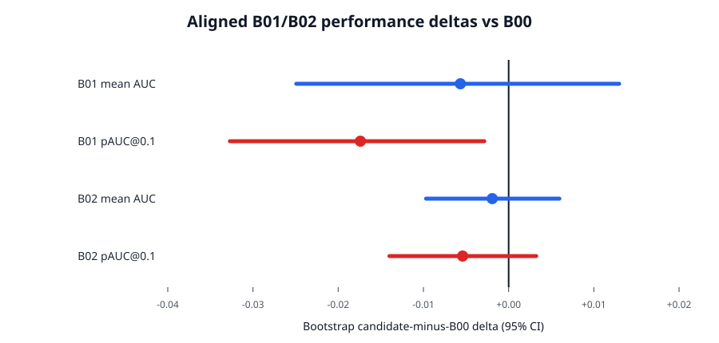
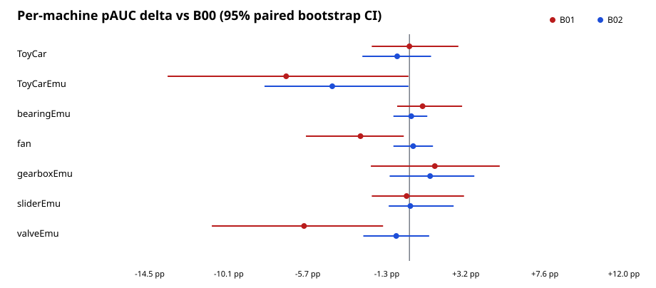
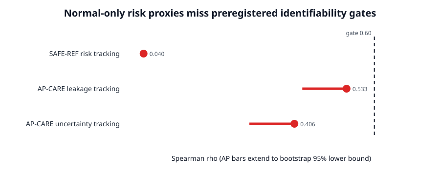
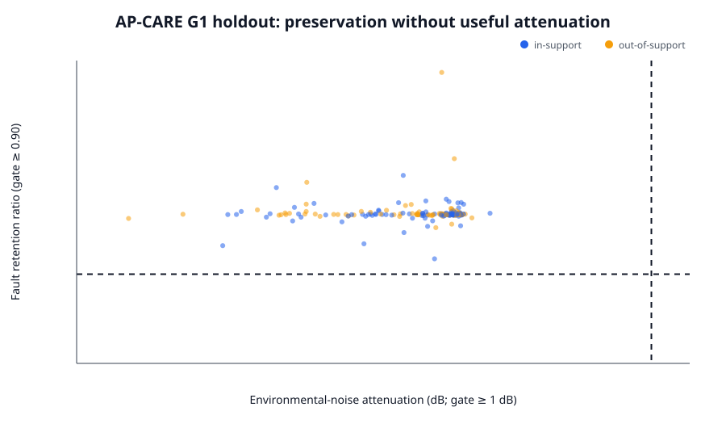

# When the Noise Reference Contains the Machine: A Controlled Safety Audit for Anomalous Sound Detection

Status: Audit-A3 manuscript draft. All quantitative statements trace to frozen artifacts under
`reports/audit/`. This document does not authorize new training, evaluation-label access, or
post-failure tuning.

## Abstract

Dual-microphone anomalous sound detection can use a far microphone as an environmental-noise
reference, but the far signal may also contain machine-origin energy. Removing reference-correlated
content can therefore reduce interference and erase fault evidence through the same operation. We
study what deterministic, normal-only reference processing can justify under this ambiguity. The
evaluation combines an official-compatible DCASE 2026 near-only detector, two capacity-controlled
stereo interventions, a frozen displacement analysis, and two independent known-component
holdouts. Replacing the near waveform with a bounded causal residual reduced mean partial AUC
(pAUC) from 0.55391 to 0.53459; the preregistered paired-bootstrap pAUC change was -0.01740 with a
95% interval of [-0.03271, -0.00286]. A near-primary reliability-gated residual did not demonstrate
improvement (change -0.00540, interval [-0.01398, 0.00323]). The harmful residual effect remained
negative after every one-machine deletion and was more adverse on target-domain recordings.
Stronger residual-induced log-Mel displacement was associated with lower anomaly-score change
(Spearman rho -0.5524). A normal-only reference-safety selector produced a 92.85% false-safe rate
on controlled mixtures. A bounded AP-CARE controller retained injected fault energy but achieved
median environmental attenuation of -0.0397 dB and failed five of six mechanism checks. These
results do not show that dual-microphone ASD is ineffective or that safe cancellation is universally
impossible. They establish a narrower empirical boundary: under the tested deterministic
normal-only controllers, observable stereo heuristics did not identify a regime that both removed
useful noise and protected unknown fault evidence. The study motivates component-level safety
audits alongside AUC and pAUC whenever an ASD frontend can suppress machine-origin content.

**Keywords:** anomalous sound detection; contaminated reference; dual microphone; identifiability;
fault preservation; domain shift; negative results

## 1. Introduction

Unsupervised anomalous sound detection (ASD) learns normal machine operation and must detect
previously unseen failures. DCASE 2026 Task 2 adds synchronized near and far microphones to an
already difficult first-shot, source/target domain-shift setting. The near microphone contains a
stronger machine observation; the far microphone is relatively noise-dominant, but it is not a
guaranteed noise-only reference. This distinction matters. A frontend that subtracts content shared
between the microphones may remove environmental interference, normal machine structure, or
fault-related energy.

Current systems show that dual-channel information can improve ASD. Noise-aware representation
learning, spectral subtraction, spatial descriptors, embedding differences, predictive residuals,
and multi-view ensembles all report useful results under some conditions. Therefore, a negative
result for one cancellation family cannot support a general claim against the far microphone. The
question addressed here is narrower:

> When the far reference is a mixed observation, can deterministic normal-only statistics identify
> and control a signal-removal operation that is simultaneously useful for interference reduction
> and safe for unknown fault evidence?

The contribution is an evaluation protocol and empirical boundary, not a new successful detector.
We align every development comparison to one locked near-only backend, separate downstream ASD
metrics from known-component physical endpoints, retain null and harmful outcomes, and enforce
preregistered stopping. This design prevents an improvement in AUC from being interpreted as proof
of fault preservation and prevents a failed method from being rescued through unreported tuning.

## 2. Related work and retained gap

The [DCASE 2026 Task 2 specification](https://arxiv.org/abs/2606.01578) defines normal-only
first-shot ASD with synchronized near/far recordings, severe source/target imbalance, unseen
evaluation machine types, and an official harmonic metric built from source AUC, target AUC, and
pAUC. [Noise-aware self-supervised learning](https://arxiv.org/abs/2608.00447) and several DCASE
technical reports provide direct counterexamples to any generic statement that dual-microphone
information is ineffective.

Relevant deterministic systems include
[reference denoising](https://dcase.community/documents/challenge2026/technical_reports/DCASE2026_Kim_91_t2.pdf),
[stereo spatial processing](https://dcase.community/documents/challenge2026/technical_reports/DCASE2026_Morita_50_t2.pdf),
[simple reference cancellation](https://dcase.community/documents/challenge2026/technical_reports/DCASE2026_Ozeki_101_t2.pdf),
and [spectral subtraction before an EAT backend](https://dcase.community/documents/challenge2026/technical_reports/DCASE2026_Qian_65_t2.pdf).
Learned systems also use embedding residuals or task-adapted dual-microphone representations. These
methods establish that reference processing and stereo fusion are prior art. The DCASE challenge
technical reports are primary system descriptions but are not peer-reviewed publications.

Desired-signal leakage in a noise reference is older than ASD; adaptive-cancellation work addressed
it at least by [Al-Kindi and Dunlop (1989)](https://doi.org/10.1016/0165-1684(89)90005-4). The
retained gap is therefore not the existence of contamination. Across the direct ASD sources in the
frozen literature matrix, we found no study that jointly reported (i) an aligned downstream effect
against the same detector, (ii) fixed known noise and fault components, (iii) separate attenuation
and fault-retention endpoints, and (iv) a frozen stop rule. Our study evaluates that combination.

## 3. Methods

### 3.1 Data and locked detector

We use the seven development machine types from DCASE 2026 Task 2. Training is normal-only. The
aligned development analysis contains the same 1,400 test clips for every candidate, with complete
coverage of 28 machine-by-domain-by-condition strata and 50 clips per stratum.

The B00 reference follows the pinned official autoencoder stack: channel 0 (near) audio, 128-bin
power Mel spectrograms (`n_fft=1024`, `hop_length=512`), log-power conversion, five-frame stacking,
and a fully connected `640-128-128-128-128-8-128-128-128-128-640` autoencoder. Training uses Adam
with learning rate 0.001, batch size 256, 100 epochs, seed 13711, and normal clips only. A WAV-level
anomaly score is the mean reconstruction MSE of its stacked feature vectors. The implementation was
required to reproduce an external official baseline within preregistered AUC and pAUC tolerances
before any CARE intervention was interpreted.

### 3.2 Aligned interventions

**B01: residual replacement.** A bounded causal CARE frontend estimates a stereo acoustic path in
the STFT domain and produces a residual waveform. Only this waveform replaces the near input. All
features, model capacity, training, seed, and scoring remain identical to B00. B01 cannot use
far-channel concatenation, test labels, score fusion, or a larger neural model.

**B02: near-primary gated residual.** The near view remains the reconstruction target and primary
branch. Near and residual feature vectors are separately projected from 640 to 64 dimensions and
concatenated, matching B00's first projection parameter count. The residual branch is multiplied by
a frozen per-clip path-confidence value in `[0,1]` computed without anomaly or domain labels. B02
was preregistered after B01 failed; Phase 8 diagnostics did not tune its gate.

### 3.3 Frozen mechanism association

For each development-test clip, Phase 8 joins the B00/B01 score difference with the aligned
residual-minus-near mean log-Mel displacement. The primary diagnostic is their Spearman
association. Displacement is an explanatory feature-space quantity, not a calibrated energy ratio,
and this post-hoc analysis cannot select another method.

### 3.4 Known-component safety holdouts

**SAFE-REF.** Independent calibration and holdout mixtures contain known normal-machine and
environmental components under controlled acoustic paths. A fixed reference-subtraction candidate
is accepted or rejected using normal-only risk statistics. The safe-use target is defined from the
known components only for evaluation. The held-out set tests false-safe decisions, coverage, risk
tracking, and tail-loss reduction.

**AP-CARE G1.** The bounded controller combines evidence for environmental-noise utility,
machine-leakage risk, and path uncertainty. The realized controller is frozen and applied
separately to known fault, normal-machine, and environmental components. This yields fault
retention and noise attenuation without allowing each counterfactual component to change the
controller being measured. An independent holdout spans reference leakage, environmental gain,
path gain and delay, transfer mismatch, fault amplitude and band, support relation, and fixed
seeds. The preregistered gate requires useful leakage/uncertainty tracking, improved matched fault
retention, absolute in-support retention, at least 1 dB eligible-case attenuation, and non-trivial
cancellation. Failure stops later GPU and evaluation stages.

### 3.5 Outcomes and inference

Development outcomes are mean AUC and standardized pAUC at maximum false-positive rate 0.1.
Candidate-minus-B00 intervals use 5,000 paired bootstrap replicates stratified by machine type,
section, and condition. Audit-A2 adds descriptive per-machine/domain metrics, 2,000 stratified
paired-bootstrap replicates for sensitivity, and leave-one-machine-out means. The original frozen
5,000-replicate intervals remain the inferential headline.

Known-component endpoints include false-safe rate, Spearman tracking coefficients, fault-energy
retention, environmental attenuation in dB, positive-attenuation fraction, and the fraction of
eligible cases reaching 1 dB. All thresholds were fixed before their corresponding holdout was
read.

### 3.6 Leakage control and reproducibility

No evaluation labels or scores were accessed. Failed holdouts were not reused for threshold
selection. The synthesis contract fixes every source path and decision, regenerates tables and
figures from committed evidence, and records portable hashes in `run.json`. The frozen decision
sets `method_route=stopped`, `gpu_replication=prohibited`, and `evaluation_access=prohibited`.

## 4. Results

### 4.1 Aligned development performance

| System | Mean AUC | Mean pAUC | Bootstrap AUC delta (95% CI) | Bootstrap pAUC delta (95% CI) | Decision |
|---|---:|---:|---:|---:|---|
| B00 near-only | 0.60813 | 0.55391 | Reference | Reference | Locked comparator |
| B01 residual replacement | 0.60251 | 0.53459 | -0.00566 [-0.02491, 0.01297] | -0.01740 [-0.03271, -0.00286] | Rejected: harmful pAUC |
| B02 gated auxiliary residual | 0.60627 | 0.54789 | -0.00192 [-0.00969, 0.00596] | -0.00540 [-0.01398, 0.00323] | Rejected: no improvement |

B01 significantly reduced pAUC under the frozen paired estimand, while its AUC interval crossed
zero. B02 had smaller negative point estimates, but neither interval demonstrated improvement. The
bootstrap delta is the preregistered stratified estimand and need not equal the simple subtraction
of displayed aggregate means.

### 4.2 Machine and domain sensitivity

| Comparison | All-domain pAUC change | Machines improved | Leave-one-machine-out range | Source change | Target change |
|---|---:|---:|---:|---:|---:|
| B01 minus B00 | -1.93 pp | 2/7 | [-2.49, -1.11] pp | +0.75 pp | -2.14 pp |
| B02 minus B00 | -0.60 pp | 4/7 | [-0.89, +0.02] pp | +0.33 pp | -1.02 pp |

B01's mean pAUC effect remained negative after deleting any one machine, so no single machine
explains the aggregate harm. Effects were nevertheless heterogeneous. B02's leave-one-machine-out
range crossed zero. Both interventions were more favorable on source than target recordings,
revealing domain fragility rather than uniform machine-level failure.

### 4.3 Feature removal and anomaly evidence

Residual-induced log-Mel displacement was negatively associated with B01-minus-B00 anomaly-score
change (Spearman rho -0.5524 across 1,400 clips). In this frozen pipeline, stronger feature removal
coincided with lower anomaly evidence. This association is consistent with suppression but is not a
causal decomposition of machine, fault, and noise energy.

### 4.4 Safety identifiability

The corrected SAFE-REF holdout contained 2,048 controlled cases, of which only 172 (8.40%) met the
synthetic safe-use definition. The normal-only policy accepted 1,776 cases and produced a 92.85%
false-safe rate (upper confidence bound 93.96%). Its risk statistic had Spearman rho 0.0400 with
known risk, and tail-loss reduction was 1.78%. The selector therefore did not identify safe
reference use.

AP-CARE G1 completed 512 controlled cases with an untouched 256-case holdout. Leakage and
uncertainty statistics reached rho 0.5326 and 0.4060, below the 0.60 thresholds. Median in-support
fault retention was 1.0001 and passed its absolute 0.90 requirement, but matched retention
improvement was only 0.0526 against the required 0.10. Median eligible-case environmental
attenuation was -0.0397 dB; none of 256 holdout cases reached 1 dB. AP-CARE therefore preserved
fault energy mainly because it performed almost no useful cancellation, and failed five of six
mechanism checks.

### 4.5 Supplementary bounded representation studies

FP-NAA V1-V10 tested whether representation-level preservation, earlier encoder taps, layerwise
repair, or certified score fusion could recover the lost evidence. Each hypothesis had a separate
frozen gate; none authorized confirmatory LOMO. These experiments are reported as a supplementary
research ledger, not as independent replications and not as additional observations in the
inferential tests above. The complete record is in
[`FP_NAA_NEGATIVE_EVIDENCE_LEDGER.md`](FP_NAA_NEGATIVE_EVIDENCE_LEDGER.md).

## 5. Discussion

### 5.1 What the evidence supports

Three layers of evidence converge under the tested assumptions. First, direct residual replacement
reduced low-false-positive detection performance. Second, a less invasive gated auxiliary path did
not demonstrate benefit. Third, controlled holdouts showed that the available normal-only risk
statistics could not distinguish useful environmental cancellation from machine-content removal.
The AP-CARE bound protected fault energy, but protection and useful attenuation did not coexist at
the registered operating point.

This supports an empirical identifiability statement: deterministic normal-only stereo statistics
were insufficient to select a reliable safe cancellation regime for these controllers and data.
The result is stronger than a leaderboard comparison because physical components and stop decisions
are explicit. It is weaker than an impossibility theorem because it covers only the tested
controllers, statistics, paths, perturbations, and machine families.

### 5.2 Why aggregate performance alone is insufficient

AUC or pAUC can improve even if a frontend removes some fault energy, and fault retention can look
excellent when a controller removes almost nothing. The relevant question is therefore a frontier:
how much environmental interference is attenuated at a stated distribution of fault retention?
Reporting only one side confounds efficacy and safety. AP-CARE illustrates this directly: retention
passed, while attenuation was effectively zero.

The source/target asymmetry adds a second warning. A reference intervention may appear helpful in
the data-rich source domain while increasing false alarms or suppressing evidence in the scarce
target domain. Machine-averaged development metrics can hide this behavior, especially when the
official endpoint emphasizes weak components through a harmonic mean.

### 5.3 Relationship to positive dual-microphone systems

Our findings do not contradict systems that obtain gains from learned noise-aware representations,
cross-channel predictive consistency, raw-spectral detectors, or heterogeneous ensembles. Those
systems use the far channel as information, not necessarily as removable noise, and can preserve
multiple views rather than replacing the near observation. The present result instead cautions
against interpreting a mixed far microphone as a safely subtractable reference without a
component-level audit.

### 5.4 Practical recommendation

Future dual-microphone ASD studies should retain an unchanged near path; report noise attenuation
jointly with fault retention; stratify source and target domains; include strong no-cancellation and
prior-art controls; and freeze selection before held-out or evaluation outcomes are read. Learned
or predictive stereo representations remain viable, but their task gain should not be described as
fault-preservation evidence unless that endpoint is measured separately.

## 6. Limitations

1. The aligned detector is an official-compatible autoencoder, not the full range of current audio
   foundation-model systems.
2. Controlled faults are proxies for mechanical anomalies. They provide component identity but do
   not span every real failure mode.
3. Development includes seven machine types and cannot establish transfer to unseen evaluation
   machines.
4. Phase 8 is a frozen post-hoc association and does not causally identify which physical component
   changed the anomaly score.
5. SAFE-REF and AP-CARE cover bounded deterministic normal-only controllers. Learned
   dual-channel representations, alternative supervision, arrays with more microphones, and known
   geometry are outside the result.
6. The sequential FP-NAA studies are scientifically useful negative evidence but are not mutually
   independent replications; they must not be pooled to inflate statistical certainty.
7. Current DCASE 2026 technical reports and several directly relevant arXiv papers were not
   peer-reviewed at the literature cutoff.

## 7. Conclusion

In a synchronized near/far ASD setting, the far microphone contained potentially useful
environmental information but could not be treated as an identified noise-only reference. The
tested residual replacement harmed pAUC, conservative fusion did not improve the near-only
comparator, normal-only safety statistics did not track the required hidden components, and a
bounded controller preserved faults by cancelling too little to be useful. The scientifically
defensible conclusion is bounded: under these conditions, safe-use selection was not identifiable
from the tested normal-only observables. Component-level safety endpoints and frozen stop rules are
therefore necessary companions to task metrics for any ASD frontend capable of suppressing machine
content.

## Data, code, and artifact availability

The project stores manifests and derived evidence without redistributing restricted audio. The
paper package is regenerated from `configs/experiment/audit_paper_v1.yaml`; machine/domain
robustness uses `configs/experiment/audit_robustness_v1.yaml`; literature claims use
`configs/research/audit_literature_v1.yaml`. Generated tables, figures, decisions, and portable
hashes are committed under `reports/audit/`. DCASE audio access and licensing follow the official
challenge and Zenodo records.

## Research integrity statement

No failed method was renamed as a successful result. No evaluation labels were accessed. Null and
harmful outcomes are retained, preregistered stop rules are enforced, and post-hoc analyses are
identified explicitly. Challenge technical reports are labeled as non-peer-reviewed evidence.
